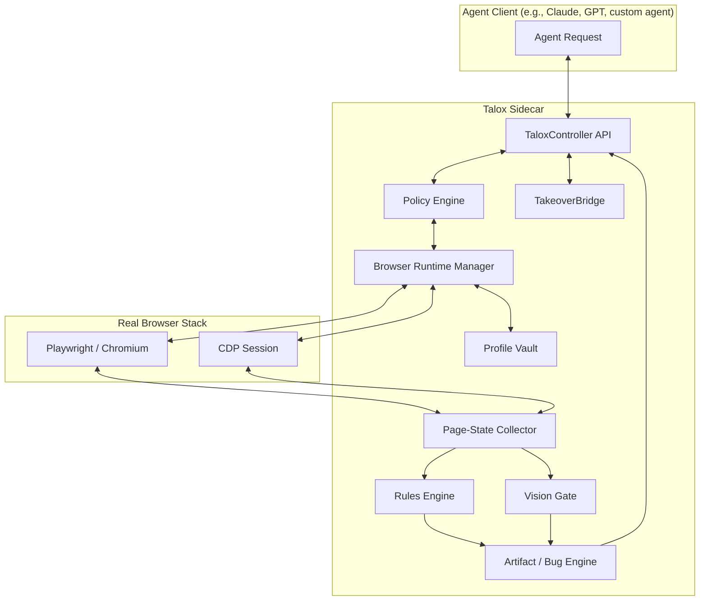

# TALOX-ARCHITECTURE.md - System Design

> **v2.0.0** — No more modes. Everything always on. Human Takeover Layer, verbosity control, auto headed/headless switching. See [CHANGELOG](../CHANGELOG.md) for full details.

## 1. System Overview
Talox follows a modular "sidecar" architecture. The AI agent interacts with the browser engine via Playwright and CDP through a single controller API.



## 2. Core Modules

### 2.1 TaloxController
- **Role:** Thin ~200-line orchestrator that delegates to `EventBus`, `TakeoverBridge`, `ActionExecutor`, and `SessionManager`.
- **Refactored from:** 2,223-line monolith in v1.2.0, now a clean sidecar API.
- **Exported classes:** `TaloxController`, `BrowserManager`, `TakeoverBridge`, `ActionExecutor`, `SessionManager`, `EventBus`.

### 2.1a Browser Runtime Manager
- **Role:** Launches and manages Chromium instances.
- **Persistent Profiles:** Manages browser contexts with separate `user-data-dir`.
- **CDP Bridge:** Exposes low-level DevTools Protocol sessions to the State Collector.

### 2.2 Profile Vault
- **Role:** Registry of managed profiles (`qa`, `ops`, `sandbox`).
- **Metadata:** Stores profile ID, class, purpose, allowed sites, and session tokens.
- **Behavioral DNA Fingerprinting:** Unique per-profile interaction parameters including typing cadence, mouse velocity curves, scroll patterns, idle micro-interactions, and cognitive load simulation delays.

### 2.3 Page-State Collector
- **Role:** Fuses data from CDP and DOM into a single machine-readable state.
- **Inputs:** DOM Snapshot, AX Tree, Bounding Boxes, Console Logs, Network Traces.

### 2.4 Rules Engine
- **Role:** Fast, rule-based bug detection.
- **Detectors:** Overlap, Clipping, Contrast, 4xx/5xx, JS Errors.

### 2.5 Vision Gate
- **Role:** Deterministic visual and structural validation.
- **Tooling:**
    - `pixelmatch` for 1px regression detection.
    - `SSIM` for noise-tolerant structural comparison.
    - `Tesseract.js` for OCR-based text verification within screenshots.
- **Baseline Vault:** Manages "Golden Master" reference screenshots in `.talox/baselines/`.

### 2.6 Verbosity System (v2)
- **Role:** Perception depth control — all features always on, control what you receive.
- **Verbosity levels:** `shallow` | `medium` | `full`
- **Deprecated:** `ModeManager` — removed in v2. Use launch options instead:
  - `verbosity: 'shallow' | 'medium' | 'full'` for perception depth
  - `headed: true | false | 'auto'` for browser display mode
  - Human Takeover Layer for human intervention

### 2.7 Bug / Artifact Engine
- **Role:** Generates evidence-rich bug reports and replay traces.
- **Output:** Markdown/JSON reports and trace files.
- **Structural Diffing:** Compares AX-Tree and DOM states to detect missing or changed elements.

### 2.8 SemanticMapper
- **Role:** Translates raw AX-Tree accessibility data to semantic entities.
- **Functionality:** Maps DOM+AX-Tree to high-level semantic objects (Button, Input, Form, Navigation), resolves implicit roles and ARIA relationships, generates stable semantic identifiers, enables intent-based interaction.

### 2.9 SelfHealingSelector
- **Role:** Auto-finds moved/renamed elements after DOM changes.
- **Functionality:** Maintains fallback selector chains (ID → class → text → position), uses SemanticMapper for intent-based recovery, re-attempts with exponential backoff.

### 2.10 NetworkMocker
- **Role:** Record/replay/mock network traffic for deterministic testing.
- **Functionality:** Records HTTP/WebSocket traffic to HAR files, replays cached responses, mocks specific endpoints, modifies responses (delays, error codes, body mutations).

### 2.11 AXTreeDiffer
- **Role:** Semantic diff between AX-Tree states.
- **Functionality:** Computes structural deltas, identifies added/removed/modified nodes, filters noise (dynamic IDs, timestamps), generates human-readable change summaries.

### 2.12 GhostVisualizer
- **Role:** Overlays biomechanical action paths on screenshots.
- **Functionality:** Renders planned vs executed trajectories, shows mouse movement curves with velocity visualization, annotates screenshots with step-by-step execution flow.

### 2.13 PolicyEngine
- **Role:** YAML-based action restriction framework.
- **Functionality:** Policy definition language with conditions, actions, and assertions. Policy chaining, dry-run mode, built-in rule library.

### 2.14 TaloxTools
- **Role:** LLM function calling schema for AI agents.
- **Functionality:** Exports 14 ready-to-use tool definitions compatible with OpenAI function calling, Claude tools, and other LLM APIs. Tools include: navigate, click, type, get_state, describe_page, get_intent_state, screenshot, scroll_to, extract_table, wait_for_load_state, set_mode, verify_visual, find_element, evaluate.

### 2.15 EventEmitter
- **Role:** Real-time event notifications for agents.
- **Functionality:** Emits events on navigation, state changes, console errors, bug detection, and mode changes. Enables agents to react to page events in real-time.

### 2.16 EventBus
- **Role:** Fully generic typed event emitter replacing NodeJS EventEmitter.
- **Type safety:** All `on/off/emit` calls TypeScript-enforced against `TaloxEventMap`.
- **Events:** `adapted`, `sessionEnd`, `annotationAdded`, `annotationUndone`, `bugDetected`, `consoleError`, `networkError`, `navigation`, `modeChanged`, `stateChanged`

### 2.17 TakeoverBridge
- **Role:** Human Takeover Layer — pauses agent execution for human intervention and manages the agent overlay (headed mode).
- **Responsibilities:**
  - Manages takeover states (`idle`, `pending`, `active`)
  - Exposes `requestTakeover()`, `getTakeoverStatus()`, `resumeAgent()`
  - Injects self-contained overlay via `page.addInitScript()` (persists across navigations)
  - Manages overlay state machine (AGENT_RUNNING ↔ WAITING_FOR_HUMAN)
  - Emits `takeoverRequested`, `takeoverStarted`, `takeoverEnded` events
  - `getCursorStepCallback()` returns per-step update function for HumanMouse (keeps OS cursor still while fake cursor animates)
- **Architecture:** No esbuild required — pure JavaScript bundle. Uses correct Playwright APIs (`addInitScript` + `exposeFunction`), not legacy `evaluate()` which resets on navigation.

### 2.18 ActionExecutor
- **Role:** All browser interaction logic extracted from TaloxController.
- **Covers:** `click`, `type`, `navigate`, `mouseMove`, `scrollTo`, `screenshot`, `evaluate`, `findElement`, `extractTable`, `fidget`, `think`, `setAttentionFrame`

### 2.19 SessionManager
- **Role:** Browser lifecycle and multi-page management.
- **Covers:** Profile loading, BrowserManager launch/stop, multi-page switching, auto-thinking idle behaviour, ObserveSession lifecycle.

### 2.20 AdaptationEngine
- **Role:** Smart mode outcome-feedback loop. Runs after every interaction.
- **Detects:** Bot signals from BotDetector; applies named strategies; emits `adapted` event.
- **Strategies:** `stealth_nudge`, `stealth_escalation`, `semantic_fallback`, `pace_reduction`, `backoff`, `captcha_pause`

### 2.21 BotDetector
- **Role:** Stateless scanner for bot-detection signals on a loaded page.
- **Detects:** CAPTCHA (title/URL patterns), hard blocks, HTTP 429, fingerprinting scripts.
- **Returns:** Array of signals ordered by severity.

### 2.22 ObserveSession / AnnotationBuffer / SessionReporter
- **Role:** Human-driven session infrastructure.
- **ObserveSession:** Manages CDP bridge, OverlayInjector, and interaction recording.
- **AnnotationBuffer:** Append-only in-memory stack with undo support.
- **SessionReporter:** Writes `TaloxSessionReport` to JSON + Markdown on session end.

## 3. Data Flow
1. **Agent Request:** Agent asks to navigate to a URL using a specific profile.
2. **Profile Loading:** Talox loads the profile and launches Chromium.
3. **Navigation:** Page loads; Talox attaches to CDP.
4. **State Collection:** Page state is fused and sent to the Rules Engine.
5. **Bug Detection:** Rules Engine flags any issues (e.g., 500 error, overlapping CTA).
6. **Vision Check:** (Optional) Vision Gate verifies visual state if flagged.
7. **Report/Artifact:** Bug report and trace are generated.
8. **Response:** Fused page state + bug alerts returned to the agent.

## 4. Adaptive Interaction Flow
1. Agent requests action (e.g., "click submit")
2. SemanticMapper resolves intent to specific element
3. SelfHealingSelector builds robust selector chain
4. PolicyEngine validates action against loaded policies
5. HumanMouse executes with Behavioral DNA timing (Fitts's Law, Bezier curves, jitter)
6. AXTreeDiffer captures pre/post state
7. GhostVisualizer records trajectory for debugging

## 5. Observe-Driven Testing Architecture

Observe mode supports a unique two-channel pattern: the human (or AI agent) drives via the browser UI, while the Node.js layer captures everything automatically.

```
Browser Page                          Node.js (Talox)
────────────────                      ─────────────────────────
User right-click → contextMenu        OverlayInjector
  → Comment Mode → elementInspector   AnnotationBuffer
    → click element → annotationModal SessionReporter
      → Save button
        window.__taloxEmit__          ← CDP bridge (exposeFunction)
          'annotation:add'            → EventBus.emit('annotationAdded')
                                      → TaloxSessionReport
Browser closes                        → session.json + session.md
                                      → EventBus.emit('sessionEnd')
```

For AI-agent-driven testing, `talox.evaluate()` replaces human interaction. The agent calls `window.__taloxEmit__('annotation:add', {...})` programmatically after detecting issues via `getState()`. This means the same observe infrastructure serves both human testers and AI agents — the session report output is identical.

**Key implementation detail**: `ctx.pages()[0]` returns the default blank page in a persistent context, not the navigated page. Always use `talox.evaluate()` (which targets the correct active page internally) when writing observe-mode tests or scripts.

## 6. Launch Options (v2)

In v2, there are no modes. All capabilities are always enabled. Control behavior via launch options:

| Option | Values | Use Case |
| :--- | :--- | :--- |
| `verbosity` | `shallow` \| `medium` \| `full` | Perception depth |
| `headed` | `true` \| `false` \| `'auto'` | Browser display mode |
| `overlay` | `boolean` | Enable session overlay |
| `record` | `boolean` | Enable session recording |

```typescript
// Fast CI run
await talox.launch('id', 'sandbox', { verbosity: 'shallow' });

// Standard automation
await talox.launch('id', 'sandbox', { verbosity: 'medium' });

// Full debugging
await talox.launch('id', 'qa', { verbosity: 'full', overlay: true, record: true });

// Auto headed for bot-protected sites
await talox.launch('id', 'sandbox', { headed: 'auto' });
```
