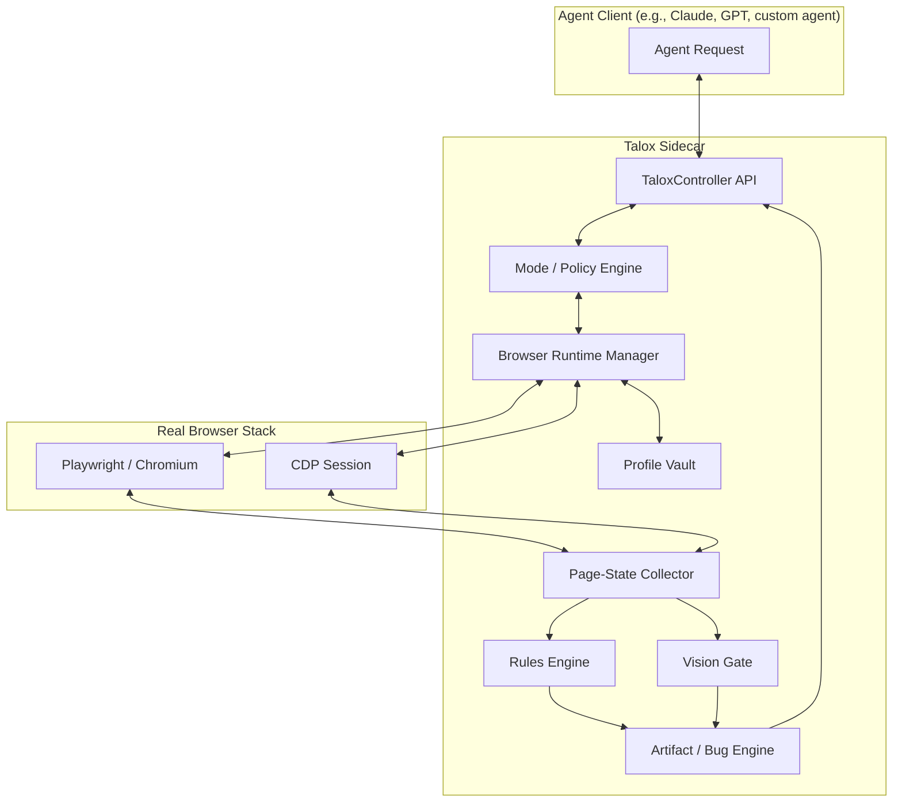

# TALOX-ARCHITECTURE.md - System Design

## 1. System Overview
Talox follows a modular "sidecar" architecture. The AI agent interacts with the browser engine via Playwright and CDP through a single controller API.

## 2. Core Modules

### 2.1 Browser Runtime Manager
- **Role:** Launches and manages Chromium instances.
- **Persistent Profiles:** Manages browser contexts with separate `user-data-dir`.
- **CDP Bridge:** Exposes low-level DevTools Protocol sessions to the State Collector.

### 2.2 Profile Vault
- **Role:** Registry of managed profiles (`qa`, `ops`, `sandbox`).
- **Metadata:** Stores profile ID, class, purpose, allowed sites, and session tokens.
- **Behavioral DNA Fingerprinting:** Unique per-profile interaction parameters including typing cadence, mouse velocity curves, scroll patterns, idle micro-interactions, and cognitive load simulation delays.

### 2.3 Page-State Collector
- **Role:** Fuses data from CDP and DOM into a single machine-readable state.
- **Inputs:** DOM Snapshot, AX Tree, Bounding Boxes, Console Logs, Network Traces.

### 2.4 Rules Engine
- **Role:** Fast, rule-based bug detection.
- **Detectors:** Overlap, Clipping, Contrast, 4xx/5xx, JS Errors.

### 2.5 Vision Gate
- **Role:** Deterministic visual and structural validation.
- **Tooling:**
    - `pixelmatch` for 1px regression detection.
    - `SSIM` for noise-tolerant structural comparison.
    - `Tesseract.js` for OCR-based text verification within screenshots.
- **Baseline Vault:** Manages "Golden Master" reference screenshots in `.talox/baselines/`.

### 2.6 Mode System
- **Role:** Dynamic behavioral orchestration.
- **Presets:** `speed`, `stealth`, `debug`, `balanced`, `browse`, `qa`.
- **Overrides:** Granular control over `mouseSpeed`, `typingDelay`, and `humanStealth`.

### 2.7 Bug / Artifact Engine
- **Role:** Generates evidence-rich bug reports and replay traces.
- **Output:** Markdown/JSON reports and trace files.
- **Structural Diffing:** Compares AX-Tree and DOM states to detect missing or changed elements.

### 2.8 SemanticMapper
- **Role:** Translates raw AX-Tree accessibility data to semantic entities.
- **Functionality:** Maps DOM+AX-Tree to high-level semantic objects (Button, Input, Form, Navigation), resolves implicit roles and ARIA relationships, generates stable semantic identifiers, enables intent-based interaction.

### 2.9 SelfHealingSelector
- **Role:** Auto-finds moved/renamed elements after DOM changes.
- **Functionality:** Maintains fallback selector chains (ID → class → text → position), uses SemanticMapper for intent-based recovery, re-attempts with exponential backoff.

### 2.10 NetworkMocker
- **Role:** Record/replay/mock network traffic for deterministic testing.
- **Functionality:** Records HTTP/WebSocket traffic to HAR files, replays cached responses, mocks specific endpoints, modifies responses (delays, error codes, body mutations).

### 2.11 AXTreeDiffer
- **Role:** Semantic diff between AX-Tree states.
- **Functionality:** Computes structural deltas, identifies added/removed/modified nodes, filters noise (dynamic IDs, timestamps), generates human-readable change summaries.

### 2.12 GhostVisualizer
- **Role:** Overlays biomechanical action paths on screenshots.
- **Functionality:** Renders planned vs executed trajectories, shows mouse movement curves with velocity visualization, annotates screenshots with step-by-step execution flow.

### 2.13 PolicyEngine
- **Role:** YAML-based action restriction framework.
- **Functionality:** Policy definition language with conditions, actions, and assertions. Policy chaining, dry-run mode, built-in rule library.

## 3. Data Flow
1. **Agent Request:** Agent asks to navigate to a URL using a specific profile.
2. **Profile Loading:** Talox loads the profile and launches Chromium.
3. **Navigation:** Page loads; Talox attaches to CDP.
4. **State Collection:** Page state is fused and sent to the Rules Engine.
5. **Bug Detection:** Rules Engine flags any issues (e.g., 500 error, overlapping CTA).
6. **Vision Check:** (Optional) Vision Gate verifies visual state if flagged.
7. **Report/Artifact:** Bug report and trace are generated.
8. **Response:** Fused page state + bug alerts returned to the agent.

## 4. Stealth Interaction Flow
1. Agent requests action (e.g., "click submit")
2. SemanticMapper resolves intent to specific element
3. SelfHealingSelector builds robust selector chain
4. PolicyEngine validates action against loaded policies
5. HumanMouse executes with Behavioral DNA timing (Fitts's Law, Bezier curves, jitter)
6. AXTreeDiffer captures pre/post state
7. GhostVisualizer records trajectory for debugging
